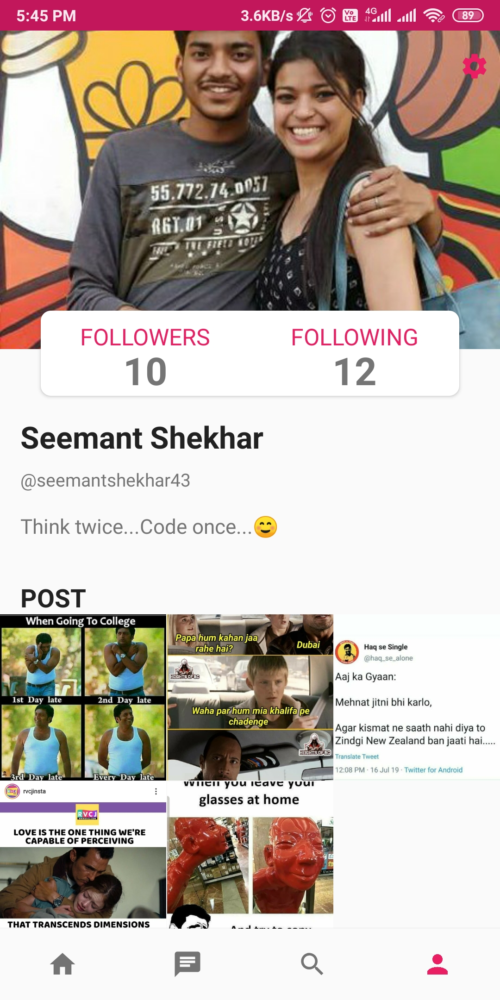
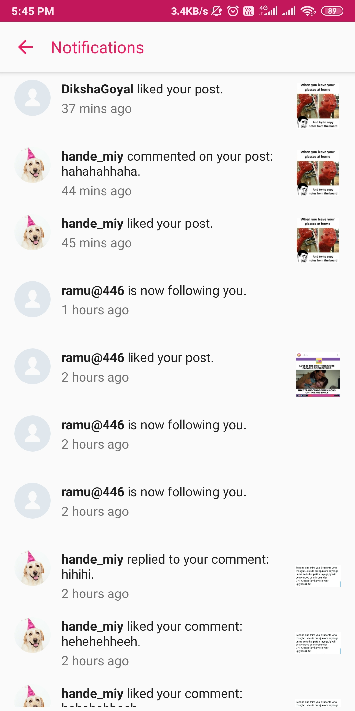
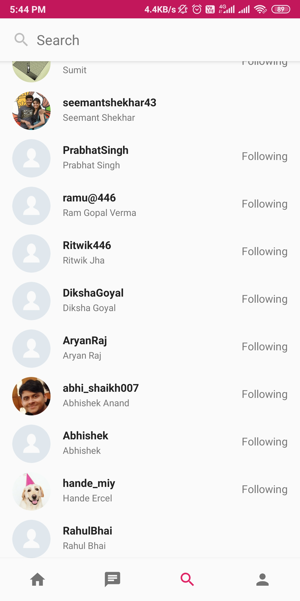

# Befikre
Befikre is a social media mobile app buit in android native environment. Many of its features are inspired from Instagram.
Befikre is a place where you let yourself be free. Follow your friends and family to see what they’re up to, and discover accounts from all over the world that are sharing things you love. Join the community and express yourself by sharing all the moments of your day — the highlights and everything in between, too.

## Get it on Google Play
[Befikre](https://play.google.com/store/apps/details?id=com.seemantshekhar.befikre)

## Technology Stack
- Android
- Java
- Firebase Realtime Database
- Firebase Cloud Functions

## Features:
- Upload photos from your phone library or take pictures straight from your camera and share them with your followers
- Show what you want on your profile
- Post photo updates from moments in your life
- Receive notifications when someone likes or comments on your post
- Follow your friends, celebrities, actors, athletes, and singers for live updates

## App preview
|                                                    Dashboard                                                     |                                                    Profile                                                    |                                                    Notifications                                                    |                                              Search                                              |
| :------------------------------------------------------------------------------------------------------------: | :--------------------------------------------------------------------------------------------------------: | :------------------------------------------------------------------------------------------------------------: | :------------------------------------------------------------------------------------------------------------: |
|  |  |  | |
